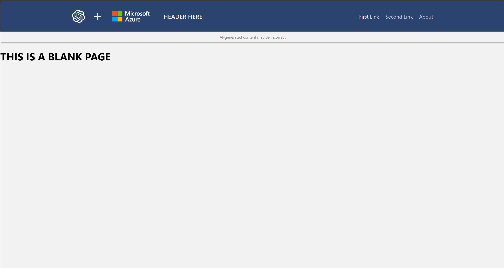

> Except where prohibited, all code and contents are distributed under the MIT License.

# Azure Open AI demo
This code is a starter pack for Azure Open AI Demos. This demo describes how to interact with azure open ai.

## HAPPY CODING

# Install and Setup 
This project uses Azure Developer Command line to install. [Azure Developer CLI Documentation](https://learn.microsoft.com/en-us/azure/developer/azure-developer-cli/) is publicly available. Normally this can be installed by using `winget install Microsoft.Azd`

## Prerequisites
The following software is helpful for install

* Azure Powershell
* Azure CLI 
* Azure Developer CLI
* Bicep
* Python
* Access to this repo
* npm
* node

## Install Steps

> These steps work in cloud shell. Be sure to grant execution on the ./scripts folder before executing `chmod 777 ./scripts`

1. `azd auth login` follow the instructions on the screen
1. `az login` follow the instructions on the screen (both are needed)
1. `azd init -t Patrick-Davis-MSFT/AlertingAI` This will download the code but will not initialize a git repository for development. 
1. `azd up` This will provision, hydrate, and deploy the demonstration
1. When finished `azd down` will remove all resources

## Local development
> Local Development will need the commands `azd auth login`, `az login` and `azd provision` run to establish services, secrets and key vaults

To run locally use `azd provision` to deploy the infrastructure and hydrate the databases. Then in the `app-ui` directory run `.\start.ps1`. 

The Application is built with a vite frontend using fluent-ui react components hosting an python API in the background. 

When coding be sure to... 
* Copy this code to a new repo
* Update the Screens to make sense
* Include all infrastructure in the bicep code
* All initialization code in the `./scripts/initialize.ps1 script` which runs post `azd provision`
* Any run requirements for local runs needs to be included in `.\app-ui\start.ps1`. 
* Do NOT include sensitive information in bicep output. This is a high level security risk. Put sensitive in Key Vault and reference appropriately with `.\app-ui\start.ps1` and the application secrets. Examples are included.
* Update the `.\data\appinfo.json` to update the about page. The version can be updated here to check for updates. 
* Do not enable App Insights locally (this is setup by default)

## Contributing to the repo

1. Direct check-ins are not allowed. Please create a pull request from your own repo
